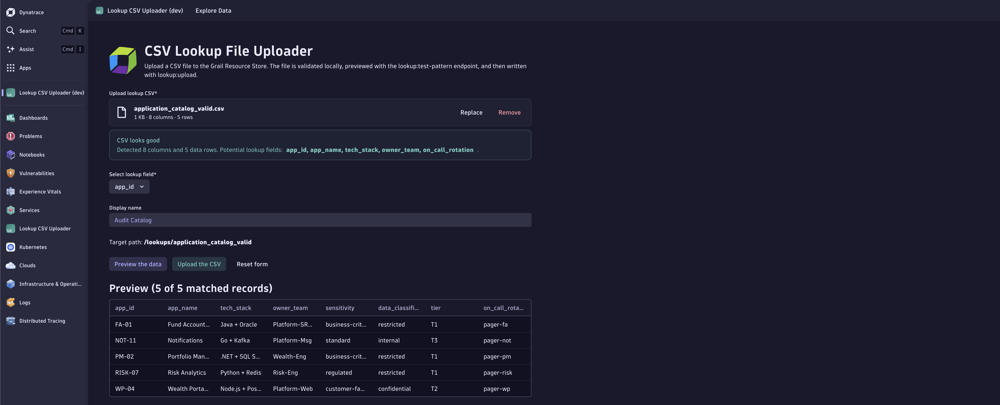

# Dynatrace Grail Lookup File Uploader

A Dynatrace App that turns the first lookup-file upload into a single screen: validate the CSV, pick a unique field as the lookup key, preview the parse, and write to the Grail Resource Store.



## About

This repo is a Dynatrace App that removes the friction around adding a CSV-based lookup table to Grail. Today the first upload is hand-rolled work: format the CSV, find a unique field for the key, build the parse pattern, and call the Resource Store API. This app does all of that from one screen.

The app validates the file in the browser, suggests a lookup field from any column with unique non-empty values, runs a server-side dry-run via the `lookup:test-pattern` endpoint, and then writes the file with `lookup:upload`. Sample CSVs in [`test-csv/`](./test-csv) cover the happy path and the main failure modes (duplicate headers, empty key cells, malformed rows, wrong file type).

## What it does

- Drop a CSV onto the upload area. The app parses it, strips any UTF-8 BOM, and validates the headers and row shape.
- It scans every column and picks columns whose values are unique and non-empty as candidate lookup fields. The first one is preselected.
- Click **Preview the data**. The app calls `lookup:test-pattern` with the parse pattern it built from your headers, and shows the first matched records and the server-side record count.
- Click **Upload the CSV**. The app calls `lookup:upload` with `filePath: /lookups/<sanitized-name>` and `overwrite: true`, then shows record count, file size, and any duplicates discarded by the server.
- A **Reset form** button clears state at any point.

## Tech stack

- [Dynatrace AppEngine](https://developer.dynatrace.com/plan/about-appengine/) (runtime)
- [Dynatrace App Toolkit](https://developer.dynatrace.com/quickstart/app-toolkit/) (`dt-app` for scaffolding, dev server, build, deploy)
- [Strato Design System](https://developer.dynatrace.com/design/about-strato-design-system/) (`@dynatrace/strato-components`, `@dynatrace/strato-components-preview`, `@dynatrace/strato-icons`)
- [Dynatrace SDK for TypeScript](https://developer.dynatrace.com/develop/sdks/) (`@dynatrace-sdk/react-hooks`, `@dynatrace-sdk/client-query`, `@dynatrace-sdk/app-environment`)
- React 18, TypeScript, React Router 6
- Grail Resource Store endpoints `lookup:test-pattern` and `lookup:upload`

## Prerequisites

Per the [App Toolkit requirements](https://developer.dynatrace.com/quickstart/app-toolkit/):

- **Node.js v24** (recommended by Dynatrace)
- A **Dynatrace tenant** with AppEngine. You can use a [free trial](https://www.dynatrace.com/trial/).
- IAM permissions to install and run apps: `app-engine:apps:install`, `app-engine:apps:run`, plus `app-engine:apps:delete` if you plan to uninstall.
- The app needs the `storage:files:write` scope to write lookup files to the Grail Resource Store. It is already declared in [`app.config.json`](./app.config.json).
- Network access to `https://dt-cdn.net/` and `https://registry.npmjs.org/`.

## Quick start

1. Clone the repo:
   ```bash
   git clone https://github.com/soheyldaliraan/dynatrace-grail-lookup-file-uploader.git
   cd dynatrace-grail-lookup-file-uploader
   ```
2. Install dependencies:
   ```bash
   npm install
   ```
3. Set your tenant URL in [`app.config.json`](./app.config.json), e.g.:
   ```json
   "environmentUrl": "https://abc12345.apps.dynatrace.com/"
   ```
4. Start the dev server:
   ```bash
   npx dt-app dev
   ```
5. Sign in to your Dynatrace tenant when prompted by the toolkit. The app opens in your browser.

To build or deploy later:

```bash
npx dt-app build      # production build into dist/
npx dt-app deploy     # build + deploy to the environmentUrl in app.config.json
npx dt-app uninstall  # remove the app from the tenant
npx dt-app info       # toolkit and environment diagnostics
```

> Increase `app.version` in `app.config.json` before each re-deploy. AppEngine rejects a deploy with the same version unless the app is uninstalled first.

New to Dynatrace App development? Start with [Write your first app in 5 minutes](https://developer.dynatrace.com/quickstart/first-app-in-5-minutes/) or the [beginner tutorial](https://developer.dynatrace.com/quickstart/tutorial/).

## Available scripts

These mirror the [`dt-app` command reference](https://developer.dynatrace.com/quickstart/app-toolkit/#command-reference):

| Script | Runs | What it does |
| --- | --- | --- |
| `npm run start` | `dt-app dev` | Start the dev server with hot reload |
| `npm run build` | `dt-app build` | Production build into `dist/` |
| `npm run deploy` | `dt-app deploy` | Build and deploy to the `environmentUrl` in `app.config.json` |
| `npm run uninstall` | `dt-app uninstall` | Remove the app from the tenant |
| `npm run info` | `dt-app info` | Show toolkit and environment info |
| `npm run update` | `dt-app update` | Update `@dynatrace-*` packages |
| `npm run lint` | `eslint .` | Lint the project |

For CI/CD, set `DT_APP_OAUTH_CLIENT_ID` and `DT_APP_OAUTH_CLIENT_SECRET` and run `npx dt-app deploy --skip-build` after a separate build step. See [Deploy your app](https://developer.dynatrace.com/develop/deploy-your-app/).

## Project structure

```
dynatrace-grail-lookup-file-uploader/
├── app.config.json              # Dynatrace App config (id, name, scopes, environmentUrl)
├── package.json                 # npm scripts and dependencies
├── test-csv/                    # Sample CSVs for manual testing (valid + failure cases)
└── ui/
    ├── main.tsx                 # React entry point
    └── app/
        ├── App.tsx              # Routes
        ├── components/
        │   ├── Header.tsx       # AppHeader with nav links
        │   └── Card.tsx         # Reusable card component
        └── pages/
            ├── Home.tsx         # CSV uploader (main page)
            └── Data.tsx         # DQL playground (default template page)
```

## How it works

1. The browser reads the dropped file as text, strips a UTF-8 BOM if present, and parses it with a small CSV parser that handles quoted fields and CRLF.
2. The parser checks that the header row has at least two non-empty unique columns and that every data row has the same number of columns. Empty cells produce a warning.
3. The app scans every column and picks columns whose values are unique and non-empty. The first one is preselected as the lookup field.
4. On **Preview the data**, the app calls the Resource Store endpoint `POST /platform/storage/resource-store/v1/files/tabular/lookup:test-pattern` as a multipart form with a JSON `request` part and the CSV `content`. It shows the first matched records and how many records the server-side parser found.
5. On **Upload the CSV**, the app calls `POST .../lookup:upload` with `filePath: /lookups/<sanitized-name>` and `overwrite: true`, then shows the record count, file size, pattern matches, and any discarded duplicates.

The `parsePattern` is built from the headers as `LD:<col1> ',' LD:<col2> ',' ...`, which is the simple comma-separated form the Dynatrace lookup parser expects for tabular CSVs.

### Test data

The [`test-csv/`](./test-csv) folder has sample files to walk the four-step flow:

| File | What it tests |
| --- | --- |
| `application_catalog_valid.csv` | Valid CSV with a clear unique key column (`app_id`) |
| `application_catalog_invalid_duplicated_header.csv` | Duplicate header names, should fail validation |
| `application_catalog_warn_empty_lookup_field.csv` | Empty cells in the candidate key column, should warn |
| `corrupt_csv.csv` | Malformed CSV that the local parser should reject |
| `not_csv.xlsx` | Non-CSV file, should be rejected before any network call |

## Limitations

- The app talks to the Resource Store over plain `fetch` against the platform path, not through a typed Dynatrace SDK client. At the time this app was built, a typed SDK for the lookup endpoints was not available on the target tenant.
- Only flat CSVs are supported. Nested JSON or non-tabular formats are out of scope.
- Files are written under the fixed prefix `/lookups/`, with the file name derived from the uploaded file (sanitized).
- The default template `Explore Data` page on `/data` is left in to show how `useDql` works. It is not part of the upload flow.

## Resources

- [Dynatrace Developer portal](https://developer.dynatrace.com/)
- [About AppEngine](https://developer.dynatrace.com/plan/about-appengine/)
- [App Toolkit reference](https://developer.dynatrace.com/quickstart/app-toolkit/)
- [Deploy your app](https://developer.dynatrace.com/develop/deploy-your-app/)
- [Strato Design System](https://developer.dynatrace.com/design/about-strato-design-system/)
- [SDK for TypeScript](https://developer.dynatrace.com/develop/sdks/)
- [Dynatrace Community](https://dt-url.net/devcommunity)

## License

[MIT](./LICENSE)
